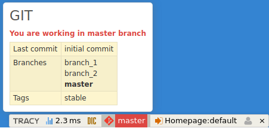

# tracy-gitpanel

[](https://travis-ci.org/nofutur3/tracy-gitpanel)
[](https://packagist.org/packages/nofutur3/tracy-gitpanel)
[](https://packagist.org/packages/nofutur3/tracy-gitpanel)

This is simple extension for [Tracy](https://tracy.nette.org/en/) which shows the information about current GIT branch
 (Have you ever worked in wrong branch? Nope? So you are probably don't need this one.)
and slightly more useful things. Just check it out.




## Installation

The recommended installation is using [composer](https://getcomposer.org/). 

_If you are not still using composer, you should check it out. It's 2016(+) afterall._

```
composer require nofutur3/tracy-gitpanel
```
Alternative way - in case you are not able to use composer. Download the source code (ie clone git repo) into your project
and require it some way. For [nette framework](https://nette.org/en/) like this in your bootstrap file:
```
$configurator
    ->createRobotLoader()
    ->addDirectory(__DIR__ . 'path/to/library/');
```

## Configuration

In your nette application it's simple, just add these lines to your config file. Depends on the structure of your config files,
but you may use the basic config.neon file. I usually add the lines just in config.local.neon file because I don't need this extension
in production mode.

##### Nette 2.3+
```
tracy:
    bar:
        - Nofutur3\GitPanel\Diagnostics\Panel
```

##### Older version of Nette:
```
nette:
    debugger:
        bar: 
            - Nofutur3\GitPanel\Diagnostics\Panel
```


#### Standalone Tracy

In case you are using Tracy without Nette, you can add GitPanel this way:

```
\Tracy\Debugger::getBar()->addPanel(new \Nofutur3\GitPanel\Diagnostics\Panel());
```
